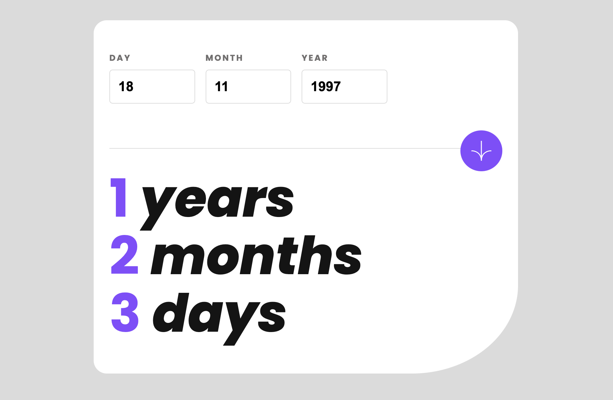

# Frontend Mentor - Age calculator app solution

This is a solution to the [Age calculator app challenge on Frontend Mentor](https://www.frontendmentor.io/challenges/age-calculator-app-dF9DFFpj-Q). Frontend Mentor challenges help you improve your coding skills by building realistic projects.

## Table of contents

- [Overview](#overview)
  - [Screenshot](#screenshot)
  - [Links](#links)
- [My process](#my-process)
  - [Built with](#built-with)
  - [What I learned](#what-i-learned)
  - [Continued development](#continued-development)
- [Author](#author)
- [Acknowledgments](#acknowledgments)

## Overview

This is my version of the age calculator challenge.

### Screenshot

### Links

- Solution URL: [Here](https://github.com/rzho17/FEM-age-calculator)
- Live Site URL: [Here](https://rzho17.github.io/FEM-age-calculator/)

## My process

I started by designing the mobile design first and added any remaing divs / styles needed to complete the project. As for the javascript section, I tried to figure out a solution first to calculate the age of the user but eventually had to look up other resources as I could not figure out how to do it.

### Built with

- Semantic HTML5 markup
- CSS custom properties
- Mobile first work-flow
- Flexbox

### What I learned

I got to practice getting user inputs as data and using it in other processes. I also got to learn how to create errors for each error case on invalid inputs.

### Continued development

I would like to learn how to develop the sliding animation that was mentioned, but I feel I have spent enough time on this project and need to keep moving forward to continue improving my skills and other projects.

## Author

- Github - [Here](https://github.com/rzho17)
- Frontend Mentor - [@rzho17](https://www.frontendmentor.io/profile/rzho17)
